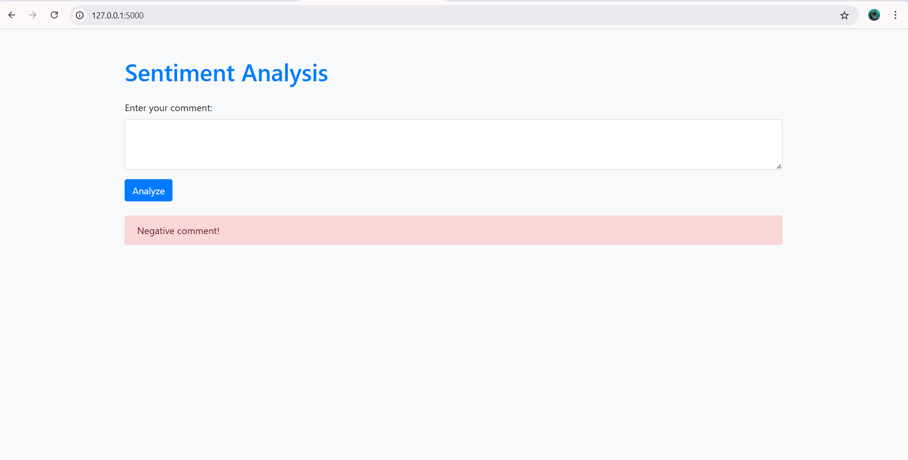

# 🤖 Sentiment Analysis Using NLP & Machine Learning

## 📌 Project Overview

This project builds a Sentiment Analysis System that classifies text data into positive, negative, or neutral sentiments using Natural Language Processing (NLP) techniques and machine learning models. The project covers data preprocessing, feature extraction, model training, and evaluation.

---

## 🚀 Features

- ✅ Text cleaning & preprocessing
- ✅ Feature extraction using TF-IDF Vectorization
- ✅ Sentiment classification using:
  - **Logistic Regression**
  - **Support Vector Classifier (SVC)**
  - **Random Forest Classifier**
- ✅ Evaluation with Accuracy, Confusion Matrix & Classification Report

---

## 📂 Project Structure

```
Sentiment_Analysis/
│
├── data/
│   └── train.tsv            # Raw dataset (text + sentiment labels)
│
├── models/
│   ├── tfidf.pkl            # Saved TF-IDF vectorizer
│   └── sentiment_model.pkl  # Trained classification model
│
├── notebook/
│   └── sentiment_analysis.ipynb  # EDA, preprocessing, and model training
│
├── app.py                    # Optional: Streamlit/Flask app for deployment
├── LICENSE
├── requirements.txt          # Project dependencies
└── README.md                 # Project documentation

```

## 🧠 Machine Learning Models

Three models were trained and evaluated:

1. **Logistic Regression**
2. **Support Vector Classifier (SVC)**
3. **Random Forest Classifier**

All models were trained using TF-IDF features extracted from the text data.

---

## 📊 Model Evaluation

Each model was evaluated using:
- ✅ **Accuracy**
- ✅ **Confusion Matrix**
- ✅ **Classification Report (Precision, Recall, F1-score)**

You can compare these metrics to decide the best performing model for deployment.

## 💡 Future Improvements
- Perform hyperparameter tuning using GridSearchCV
- Integrate deep learning models like BERT or LSTM for advanced sentiment analysis

Below is a preview of the Streamlit application:


